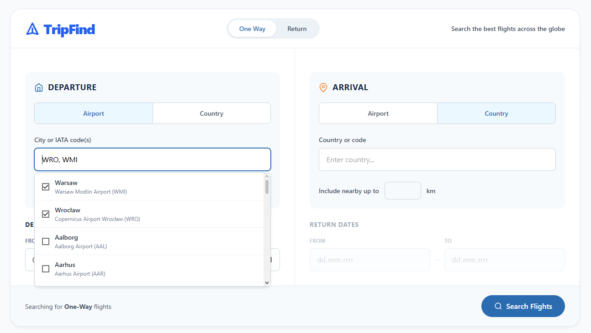
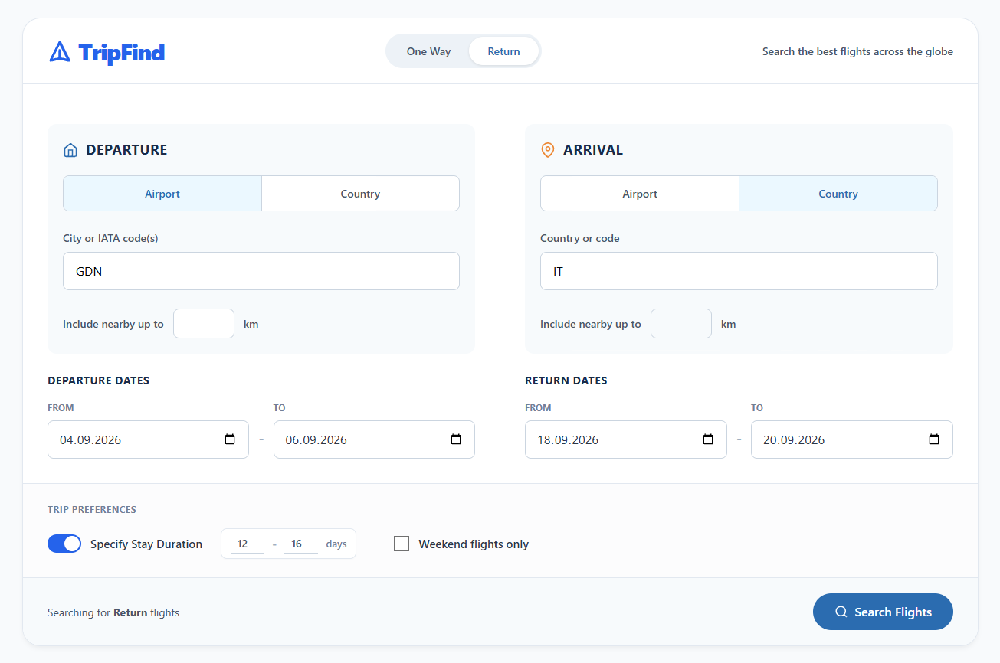
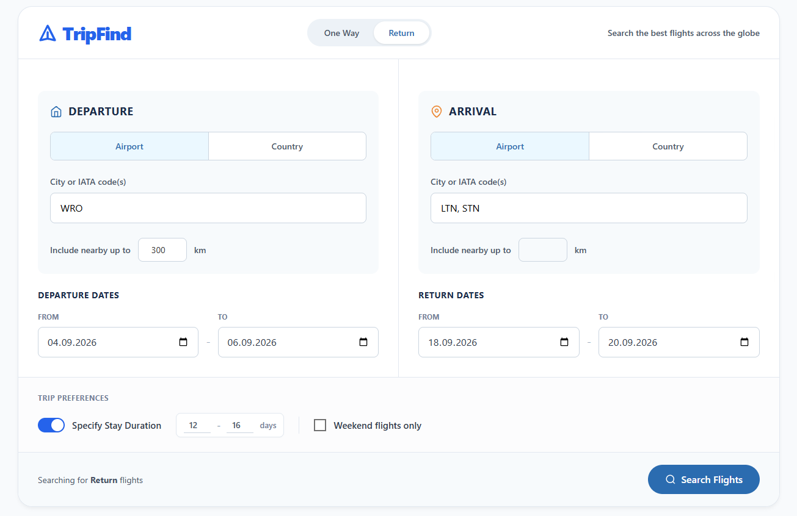
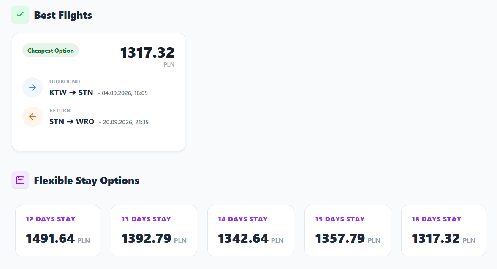
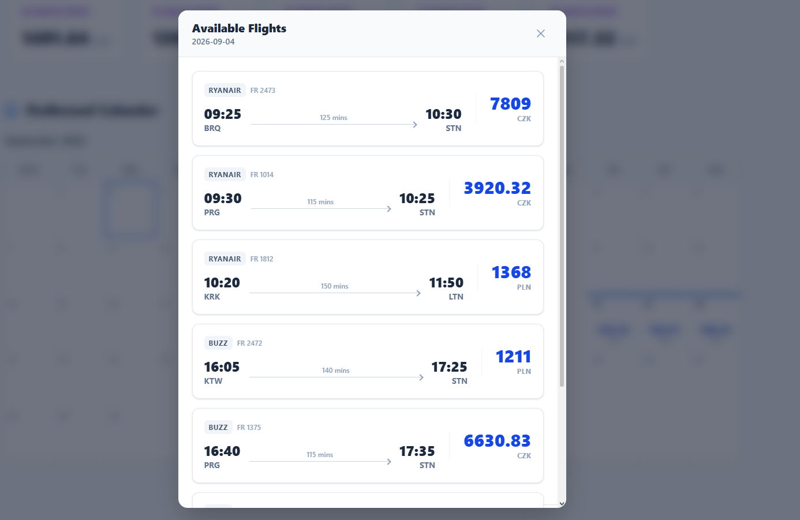

# TripFind

TripFind is an application for finding the cheapest flights while taking flexible dates, multiple airports, and airport proximity into account. The project combines a Vue 3 interface with an asynchronous FastAPI API, a PostgreSQL/PostGIS database, and a Playwright-based scraper.

> This project is a demonstrational MVP. Flight prices and availability are fetched live from Ryanair, so search results depend on current availability, response times, and changes to the external service.

## Screenshots

### Search Form







### Search Results






## Key Features

- one-way and return flight searches;
- selection of up to three departure and arrival airports;
- search by IATA code or by all airports in a country;
- airport searches within a radius of up to 500 km from a selected airport;
- departure and return date ranges instead of a single fixed date;
- filtering by minimum and maximum stay length;
- a dedicated weekend flight search mode;
- cheapest-flight, flexible-stay, and price-calendar views;
- automatic rejection of invalid parameter combinations before scraping starts;
- persistence of fetched flights in the database;
- geographic calculations performed by PostGIS.

## Technology Stack

### Backend

- Python 3.12
- FastAPI and Uvicorn
- Pydantic v2 and `pydantic-settings`
- SQLAlchemy 2.0 in async mode
- PostgreSQL 16 with the PostGIS extension
- Alembic for schema migrations
- Playwright + Chromium for fetching Ryanair data
- Pytest for service and utility tests

### Frontend

- Vue 3 with the Composition API
- Vite
- Tailwind CSS
- `@vuepic/vue-datepicker`
- Nginx for serving the production build and proxying `/api/`

## Architecture

```text
frontend/tripfind/       Vue 3 + Vite
					|
					| HTTP /api/v1/*
					v
backend/app/             FastAPI
	api/v1/                HTTP endpoints
	schemas/               request and response validation
	services/scraper/      scraper adapter and batch execution
	services/              geography, repository, and aggregation
	models/                SQLAlchemy models
					|
					v
PostgreSQL + PostGIS     airports, countries, and fetched flights
```

The search flow works as follows:

1. The frontend sends search parameters to `POST /api/v1/search/`.
2. FastAPI and Pydantic validate dates, airports, countries, and stay lengths.
3. The geographic layer expands the criteria into a list of airports, using PostGIS for radius searches.
4. The runner creates route and date-range combinations, then executes parallel requests with a limit of five tasks.
5. The `RyanairScraper` adapter opens the Ryanair page through Playwright and captures the availability response.
6. The fetched data is normalized, stored in the database, and aggregated into the cheapest flights, stay durations, and calendar views.

## Running with Docker Compose

### Requirements

- Docker Desktop z Docker Compose;
- internet access from the backend container, required for fetching Ryanair data.

### Start

From the repository root:

```powershell
Copy-Item backend/.env.example backend/.env
docker compose up --build
```

Once started, the application is available at:

| Service           | URL                         |
| ----------------- | --------------------------- |
| Frontend          | http://localhost            |
| API health check  | http://localhost/api/health |
| Swagger UI        | http://localhost:8000/docs  |
| ReDoc             | http://localhost:8000/redoc |
| Direct API access | http://localhost:8000       |

On startup, the backend container automatically:

- runs `alembic upgrade head`;
- seeds the database with countries;
- seeds the database with airports;
- starts Uvicorn.

Stop the containers:

```powershell
docker compose down
```

Remove the PostgreSQL data as well:

```powershell
docker compose down -v
```

The last command removes the `tripfind_postgres_data` volume, so the next startup recreates the database and runs the data seeding process again.

## Environment Configuration

The backend reads variables from `backend/.env`:

```dotenv
POSTGRES_USER=postgres
POSTGRES_PASSWORD=your-password
POSTGRES_DB=flights_db
POSTGRES_HOST=db
POSTGRES_PORT=5432
```

With Docker Compose, `POSTGRES_HOST=db` points to the database service name inside the Compose network. When running the backend locally outside Docker, use `POSTGRES_HOST=localhost` and make sure PostgreSQL/PostGIS is running on port `5432`.

The frontend optionally supports `VITE_API_URL`:

```dotenv
VITE_API_URL=http://localhost:8000
```

When this variable is not set, the frontend uses the relative `/api` path. This is the default Docker build configuration because Nginx forwards `/api/` requests to the backend container.

## API

The complete interactive API contract is available in Swagger UI at `http://localhost:8000/docs`.

### Endpoints

| Method   | Endpoint               | Description                        |
| -------- | ---------------------- | ---------------------------------- |
| `GET`  | `/api/health`        | Check whether the API is available |
| `GET`  | `/api/v1/airports/`  | List airports sorted by city       |
| `GET`  | `/api/v1/countries/` | List countries sorted by name      |
| `POST` | `/api/v1/search/`    | Search for and aggregate flights   |

### Example: Airport-based Search

```http
POST /api/v1/search/
Content-Type: application/json
```

```json
{
	"dep_airports": ["WRO"],
	"arr_airports": ["BCN", "MAD"],
	"dep_date_start": "2026-06-01",
	"dep_date_end": "2026-06-15",
	"arr_date_start": "2026-06-08",
	"arr_date_end": "2026-06-29",
	"min_stay_days": 3,
	"max_stay_days": 10,
	"weekend_flights": false
}
```

Search can also be performed by country:

```json
{
	"dep_airport_country_code": "PL",
	"arr_airport_country_code": "ES",
	"dep_date_start": "2026-06-01",
	"dep_date_end": "2026-06-15"
}
```

For a single airport, the search can be expanded with a radius:

```json
{
	"dep_airports": ["WRO"],
	"dep_max_distance_km": 150,
	"arr_airports": ["BCN"],
	"dep_date_start": "2026-06-01",
	"dep_date_end": "2026-06-01"
}
```

### Search Response Structure

The response contains three views:

```json
{
	"best_overall": {
		"cheapest_price": 42.5,
		"currency": "EUR",
		"flights": []
	},
	"calendar_view": {
		"outbound": {},
		"return": {}
	},
	"flexible_durations": {}
}
```

- `best_overall` contains the cheapest matching option;
- `calendar_view` groups flights by local departure date and identifies the cheapest flight for each day;
- `flexible_durations` groups the cheapest return combinations by the number of stay days.

## Search Validation Rules

The API rejects, among other cases:

- missing airports and a missing country code on either the departure or arrival side;
- using a country together with specific airports or a radius;
- using a radius with anything other than exactly one airport;
- more than three airports on either side of a search;
- invalid IATA and ISO 3166-1 alpha-2 codes;
- an end date earlier than the start date;
- an incomplete return date range;
- a stay range where the maximum is smaller than the minimum;
- stay parameters in a one-way search;
- weekend searches without single departure and return dates or without a sufficiently wide date range.

## Local Development Without the Full Stack

### Backend

This requires a running PostgreSQL/PostGIS instance and a configured `backend/.env` file.

```powershell
cd backend
py -3.12 -m venv .venv
.\.venv\Scripts\Activate.ps1
python -m pip install -r requirements.txt
playwright install chromium
alembic upgrade head
python scripts/seed_countries.py
python scripts/seed_airports.py
uvicorn app.main:app --reload
```

The backend will be available at `http://localhost:8000`.

### Frontend

```powershell
cd frontend/tripfind
npm install
npm run dev
```

The development frontend will be available at the URL shown by Vite, usually `http://localhost:5173`. For this setup, set `VITE_API_URL=http://localhost:8000` in the frontend `.env` file if no local proxy is configured.

Production frontend build:

```powershell
npm run build
npm run preview
```

## Testing

Run backend tests from the `backend` directory:

```powershell
pytest
```

The current test suite covers, among other things:

- geographic calculations and airport selection related to a route;
- handling of nonexistent airports and countries;
- splitting date ranges into chunks;
- calculating dates for weekend searches;
- converting flight durations to minutes.

## Repository Structure

```text
backend/
	app/
		api/v1/              FastAPI endpoints
		core/                configuration and database connection
		models/              SQLAlchemy models
		schemas/             Pydantic models
		services/            domain logic and scraper
		utils/               date utilities
	alembic/               database migrations
	data/                  country and airport source data
	scripts/               seeding and administration scripts
	tests/                 unit tests
frontend/tripfind/
	src/                   Vue application and view components
	public/                static assets
	nginx.conf             static hosting and API proxy configuration
docs/
	CONVENTIONS.md         Conventional Commits convention
docker-compose.yml       local application stack
```

## Technical Decisions

- **PostGIS** stores airport locations as points and performs radius searches in meters instead of requiring manual calculations in Python.
- **Async SQLAlchemy and FastAPI** allow multiple I/O operations to be handled without blocking the main API flow.
- The **`BaseScraper` adapter** separates the scraper contract from the provider implementation, allowing another carrier to be added without rebuilding the aggregation layer.
- A **concurrency limit of five tasks** controls the load on the external service and the container resources.
- **Alembic and seeding scripts** provide a repeatable environment startup while keeping schema migrations separate from reference-data loading.
- **Nginx** serves the frontend and proxies the API through the same origin, simplifying production-build deployment.

## Known Limitations and Future Work

- Only the Ryanair adapter is currently implemented; the external site may change its response format, restrict traffic, or require additional handling.
- Browser-based scraping is more expensive and slower than using a stable official API.
- Results and prices are point-in-time snapshots and do not constitute a booking or a guarantee of availability.
- Potential improvements include result caching, retry with backoff, request-level timeouts, and observability through metrics and tracing.
- Natural next steps include additional carriers, API integration tests, fixture-based scraper tests, travel-time filters, and links to the booking flow.
- Before public deployment, CORS should be restricted and rate limiting and secure secret management should be added.

## Commit Convention

The repository follows Conventional Commits. Commit descriptions are written in English, start with a lowercase letter, and use this format:

```text
<type>(<scope>): <description>
```

Example:

```text
feat(api): add flexible date search
```

More details are available in [docs/CONVENTIONS.md](docs/CONVENTIONS.md).

## Project Status

TripFind is a working MVP demonstrating the complete flow from user parameters through validation and data fetching to result aggregation in a clear interface. Its main technical focus is combining combinatorial search, geographic data, asynchronous scraping, and flexible travel-option presentation in one coherent system.
